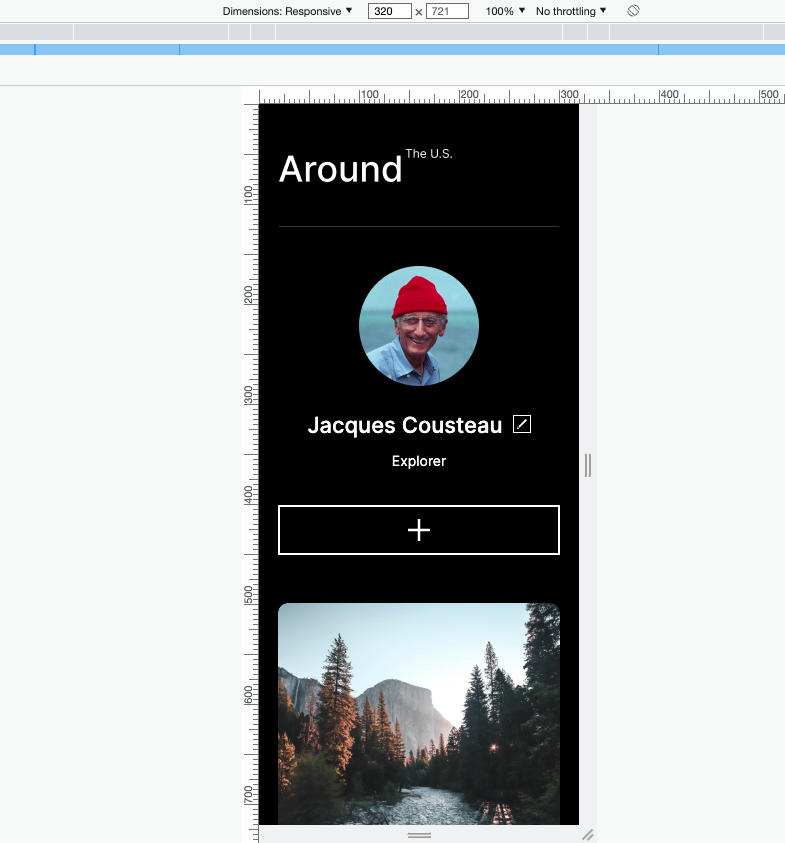

# Project 3: Around The U.S.

### Overview

**SiteDescription**

Around The U.S. is flexible responsive site available for desktop, tablet and mobile. With this website will be able to create a profile where the can create a profile, add/remove photos and even like other user photos. The user will get the same experience on any device when the visit the website.

**TechnologiesUsed**
Grid layout used throught the site to improve position of items for the structure of the site.

Media Queries were used at specific breaking points to adjust with different devices used by the user.

**TechnologiesUsed**
Adjusted the size of fonts/buttons/icons for smaller devices screens in the specific media queries for a better user experience.

**Figma**

- [Link to the project on Figma](https://www.figma.com/file/ii4xxsJ0ghevUOcssTlHZv/Sprint-3%3A-Around-the-US?node-id=0%3A1)

**Images**
Here's how the site appears in desktop mode:
[label](images/1080-Screenshot)

Here's how the site appears in mobile mode:

**linktoGitPages**
https://gerson773.github.io/se_project_aroundtheus/
